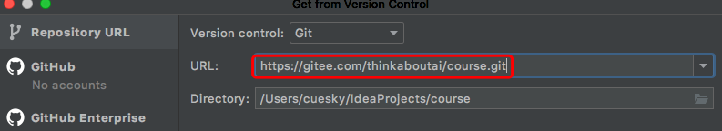

# 内容提要
根据上课的知识点进度划分为不同的分支，供2204班级学员跟近下载

# 1. 课堂之前的一些准备工作

1. 安装好`Git`工具

   下载地址 [https://git-scm.com/](https://git-scm.com/)

2. 通过`IDEA`新建项目

   选择 `Get from VCS`创建

   

# 2. Git基本操作

## 2.1 基本指令含义

- fetch 刷新分支列表，让本地和远程仓库的分支信息保持同步
- commit 提交代码改变至本地仓库缓存
- push 提交本地仓库缓存到远程仓库
- update 更新本地仓库缓存到最新版本

## 2.2 如何理解和使用branch

`branch`是某一个时间节点上的代码的集合，代表针对某一个特定的需求所编写的代码内容集合，`branch`的命名规范每一个项目组都各有不同，进行开发前，需向项目组进行了解

